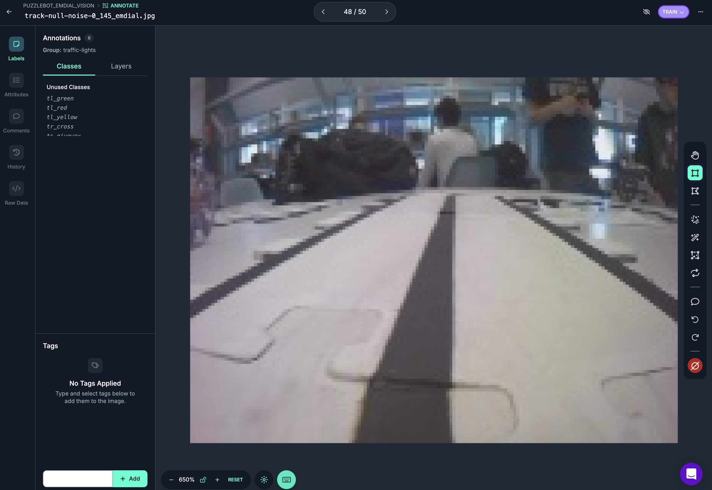
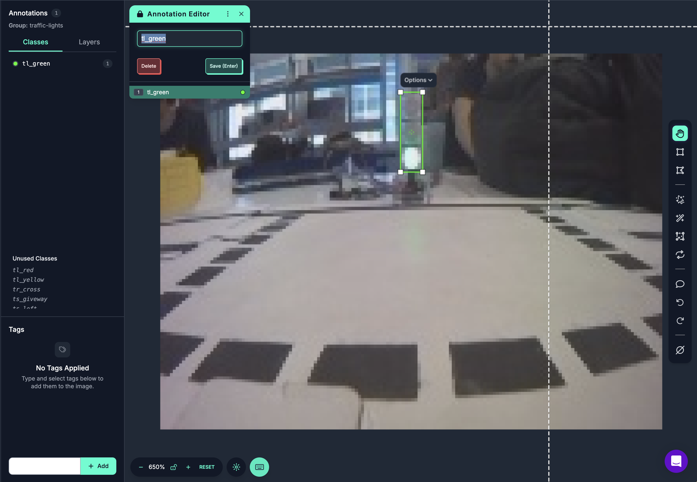
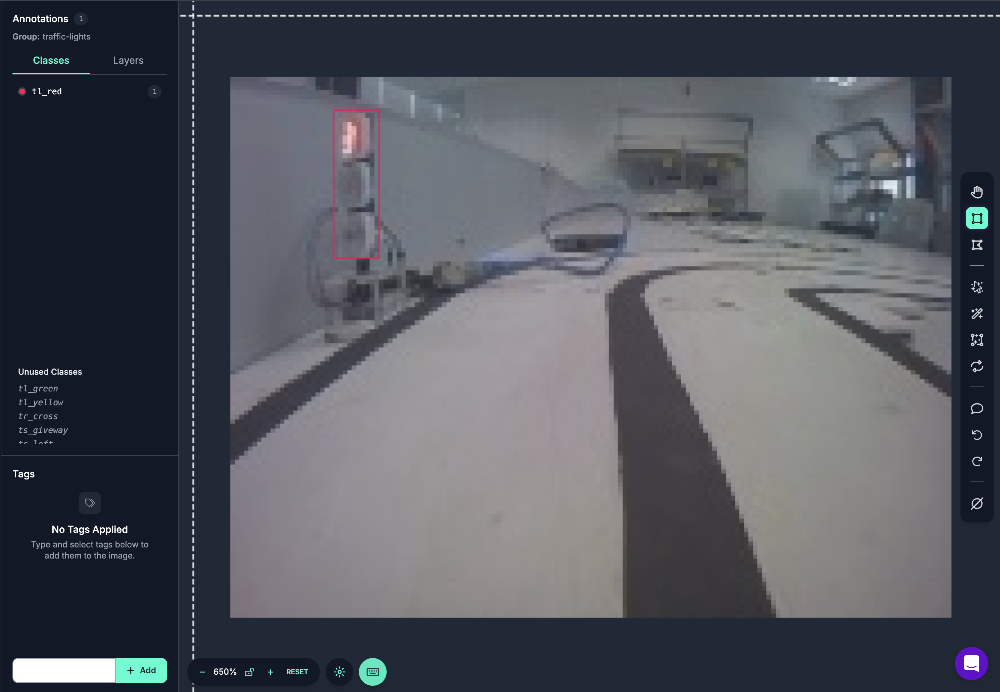

# Collaborative Data Set for Puzzlebot Vision

Collaborative dataset repository containing annotated images for training vision inference models for the Puzzlebot.

**Please read this document in its entirety to understand how to contribute and use the dataset effectively.**

Currently, the dataset does not contain any traffic sign images.

## Contribute

To obtain access dataset files, submit a minimum of **2500 annotated images**, we hope you contribute further as you grow your annotated collection. A balance across all classes is highly encouraged. A minimum of **10%** (not exceeding 30%) of your images must be [**Null Examples**](#null-examples) (background). Once verified, processed and added, you will receive full access to the dataset.  

The images submitted should be in JPG format, with a resolution of **160x120 pixels**. The annotations should be in YOLO format, with each image having a corresponding label file containing the class ID and bounding box coordinates. Your corresponding ([`data.yaml`](#datayaml)) file generated by Roboflow or similar tools should include the class names in the order specified* in [**Classes**](#classes) and paths to the training, validation, and test datasets.

> ***Note:** **DO NOT** blindly edit the **names:** section in the `data.yaml` file corresponding to your personal/submission dataset, as it may not match the Class IDs assigned to each annotation. As long as the class names are aligned, once preprocessing is done to insert your submission into the main dataset, the classes will be reordered appropriately.
---
> **Important:** ***Ensure ALL images are taken with the puzzlebot camera.***
---
*Only sumbit images that are related to the lab environment, do not add images that are not related to the Puzzlebot environment, such as images of other robots, vehicles, or objects that do not fit the classes defined in this dataset nor background images outside the Puzzlebot environment not lighting profiles outside those ocurring within the lab.*

If there are any issues with your submission, you will be contacted via the email address provided in your GitHub profile.

*Any concerns, questions, or suggestions, open an issue in the [GitHub repository](https://github.com/aldrick-t/puzzlebot_dataset_public).

## Dataset Characteristics

- Image Size: 160x120 pixels
- Image Format: JPG
- Annotation Format: YOLO TXT
- Number of Classes: 10 (currently 3 traffic light classes and 7 traffic sign classes) (currently no traffic sign images)
- Total Number of Images:

### Dataset Structure

The dataset is organized into the following structure:

``` txt
dataset/
├── train/
│   ├── images/
│   └── labels/
├── val/
│   ├── images/
│   └── labels/
├── test/
│   ├── images/
│   └── labels/
├── data.yaml
├── README.md
```

## Classes

| Class ID | Class Name       |
|----------|------------------|
| 0        | tl_green         |
| 1        | tl_red           |
| 2        | tl_yellow        |
| 3        | ts_left          |
| 4        | ts_right         |
| 5        | ts_straight      |
| 6        | ts_work          |
| 7        | ts_stop          |
| 8        | ts_roundabout    |
| 9        | ts_giveway       |

## Annotations

Annotations are provided in YOLO format, where each label file corresponds to an image file and contains the class ID and bounding box coordinates in the format:

```txt
<class_id> <x_center> <y_center> <width> <height>
```

### Example Annotation

For an image named `example_image.jpg`, the corresponding label file `example_image.txt` might look like this:

```txt
0 0.5 0.5 0.1 0.1
1 0.3 0.4 0.2 0.2
```

### Annotation Visual Example

Examples showing how the bounding boxes and labels are applied to images using Roboflow.


Null Example (background) images should not contain any annotations and should be marked as null (empty annotation file).





### Data.yaml

The `data.yaml` file contains the dataset configuration, including class names and paths to the training, validation, and test datasets. Here is an example of what it *might* look like:

``` yaml
train: train/images
val: val/images
test: test/images
nc: 10
names: ['tl_green', 'tl_red', 'tl_yellow', 'ts_left', 'ts_right', 'ts_straight', 'ts_work', 'ts_stop', 'ts_roundabout', 'ts_giveway']
```

Additional information could be contained when using a tool like Roboflow, **remove before submitting**.

``` yaml
roboflow:
  workspace: workspace_name
  project: project name
  version: 1
  license: license_name
  url: https://universe.roboflow.com/
```

## Null Examples

Null examples are images that do not contain any of the defined classes. These images should be included in the dataset to help the model learn to distinguish between relevant objects and background noise. Null examples should have an empty annotation file (no bounding boxes or class IDs).

When taking null example images, ensure that they are representative of the background in the lab environment. These images should not contain any traffic lights or traffic signs, and should be taken under various lighting conditions to improve model robustness. Do not overly clean the background, as the model should learn to recognize the lab environment as a valid context with all its variations and sources of noise (e.g., shadows, reflections, colored objects, windows, lighting sources, objects, etc.).

## License

This dataset is licensed under the [CC BY-SA 4.0](https://creativecommons.org/licenses/by-sa/4.0/)
